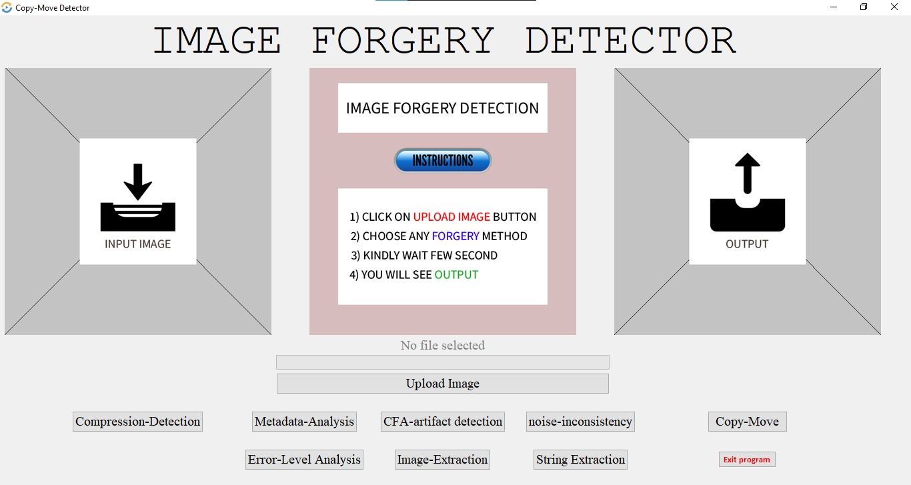

# Image Manipulation Detection System

The Image Manipulation Detection System is a Python-based GUI program for detecting image manipulations and forgeries. It utilizes various techniques such as compression detection, metadata analysis, CFA artifact detection, noise inconsistency, copy-move detection, error level analysis, image extraction, and string extraction to identify image manipulations.

## Features

- Upload images and choose forgery detection methods.
- Detect image manipulations using advanced techniques.
- View detection results and open output images if applicable.

## Installation

1. Clone the repository: `git clone https://github.com/your-username/image-manipulation-detection.git`
2. Install the required libraries: `pip install -r requirements.txt`

## Usage

1. Run the `main.py` file: `python main.py`
2. Use the GUI to upload an image and select forgery detection methods.
3. Click the "Detect" button to start the detection process.
4. View the detection results in the GUI and open output images if applicable.

## Libraries Used

- [OpenCV](https://opencv.org/): Image processing and manipulation.
- [NumPy](https://numpy.org/): Numerical computations.
- [Pillow](https://python-pillow.org/): Image manipulation.
- [scikit-learn](https://scikit-learn.org/): Advanced forgery detection.
- [Tkinter](https://docs.python.org/3/library/tkinter.html): GUI development.


# Image Forgery Detection Tool
The forgery detection tool contained in this repository currently features forensic methods to detect the following:

- Double JPEG compression
- Copy-move forgeries
- Metadata Analysis
- CFA artifacts
- Noise variance inconsitencies
- Error Level Analysis
- Image Extraction
- String Extraction
- For More Detail - [Research Paper](https://journals.grdpublications.com/index.php/ijprse/article/view/537/507)

## To Run:
<!-- Place any(JPEG) images that you wish to analyze into the **image** folder Present in the Project directory. -->

Navigate to the **Project** directory:
```
$ cd Image_Manipulation_Detection_System_Python
```

Next, run the **detect.py** script, providing the image you wish to evaluate:
```
$ python GUI.py
```

Once finished, details on the image will be reported in the terminal. Supplemental images generated during copy-move forgery detection can be found in the output directory.

##  IMAGES



## License

This project is licensed under the [MIT License](LICENSE).

## Contributions

Contributions to the project are welcome. Please fork the repository, make your changes, and submit a pull request.

## Credits

This project was developed by [Your Name](https://github.com/your-username).

Feel free
